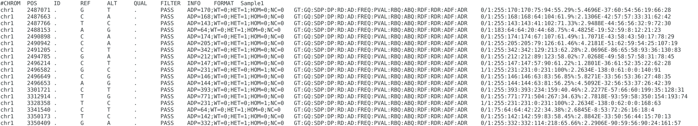

## 主要内容

- 癌症液体活检及其意义
- 液体活检中的基因检测技术
- 对未来的展望及思考

# 癌症液体活检及其意义

## 世界癌症发病率及死亡率

  
<small>(http://globocan.iarc.fr/)</small>

## 癌症研究史上的重要事件

| 时间 | 事件 |
|------|------|
| 1863、1889年 | 癌症的细胞起源学说、种子土壤假说 |
| 1894年 | **手术疗法**：乳房根治术 |
| 1914年 | 癌症由染色体突变引起 |
| 1928年 | **放射疗法**：用于头颈部肿瘤 |
| 1943年 | **化学疗法**：氮芥用于治疗淋巴瘤 |
| 1944年 | 确定DNA携带遗传信息 |
| 1969年 | 癌基因假说 |
| 1971年 | 美国总统尼克松签署《国家癌症法案》：向癌症宣战 |
| 1992、1998年 | **免疫疗法**：白介素-2用于治疗转移性肾癌及转移性黑色素瘤 |
| 2005年 | TCGA（The Cancer Genome Atlas）计划 |
| 2006年 | **靶向药物**：伊马替尼用于慢性髓性白血病 |
| 2015年 | 美国总统奥巴马宣布启动**精准医疗**计划 |

<small>(参考自：DeVita, 2012)</small>

## 癌症诊断治疗中的问题

- 传统检测手段：影像学检查、组织活检
- 识别困难、早期无法发现
- 有创伤取样，存在较大风险
- 肿瘤存在异质性，信息采集并不全面
- 术后病程追踪困难，不能准确把握耐药及复发等信息

## 癌症液体活检基本原理

  
<small>(Schwarzenbach, 2011)</small>

## 液体活检的检测对象

- 循环肿瘤细胞：CTC, Circulating Tumor Cell
- 循环肿瘤DNA：ctDNA, Circulating Tumor DNA  
  细胞外游离DNA：cfDNA, Cell Free DNA
- 外泌体：Exosomes
- 体液中其它肿瘤标志物(biomarkers)

## 液体活检涉及的部分检测技术

- 流式细胞仪分选
- 荧光原位杂交：FISH, Fluorescence in situ hybridization
- 实时定量qPCR：Real-time Quantitative PCR
- 液滴数字PCR：ddPCR, Droplet Digital PCR
- 新一代测序技术：NGS, Next Generation Sequencing

## 癌症液体活检的优势及意义

- 高灵敏、无创伤、信息全
- 癌症早期发现及筛查
- 指导靶向药物选择，个性化用药
- 伴随诊断监测及实时干预

## ctDNA及癌症早筛

  
<small>(Sausen, 2015)</small>

## 癌症通路及靶向药物

  
<small>(图片来自臻和宣传材料)</small>

## 基因突变及癌症病程进展

  
<small>(Ding, 2011)</small>

## 实际案例

  
<small>(臻和CR20150002：胃癌IV期）</small>

# 液体活检中的基因检测技术

## 染色体与DNA

  
<small>(图片来自网络)</small>

## 人类染色体照片

  
<small>(图片来自网络)</small>

## PCR（链式聚合酶反应）原理

  
<small>(`https://en.wikipedia.org/wiki/Polymerase_chain_reaction`)</small>

## 传统DNA测序技术原理

  
<small>(图片来自网络)</small>

## 新一代测序技术原理

  
<small>(图片来自网络)</small>

## 测序数据示意图

  
<small>(`https://en.wikipedia.org/wiki/DNA_sequencing`)</small>

## 靶向基因测序技术

  
<small>(图片来自网络)</small>

## 数据分析基本流程

## 测序数据(FASTQ)示例

<small>(说明参见：`https://en.wikipedia.org/wiki/FASTQ_format`)</small>

## 回贴基因组结果(SAM/BAM)示例

<small>(说明参见：`https://github.com/samtools/hts-specs`)</small>

## 突变结果(VCF/BCF)示例

<small>(说明参见：`https://github.com/samtools/hts-specs`)</small>

## 核心统计问题

- 识别突变：A是样本的基因突变，B是测序数据
- 用药指导：A是某种药物的疗效，B是样本的基因突变
- 复发预测：A是未来复发的概率，B是基因突变及采取的治疗方法

## 面临的诸多挑战

- 数据种类多样，且质量参差不齐
- 实验环节多，每个步骤都引入更多误差
- 针对特定问题，样本数相对不足
- 需要尽可能整合并利用已知信息，包括各类科研及临床实验结果

# 对未来的展望及思考

## 测序行业迅速发展

  
<small>(http://www.bio360.net/news/show/19086.html)</small>

## 每个(人)基因组测序成本

  
<small>(https://www.genome.gov/sequencingcosts/)</small>

## SRA（Sequence Read Archive）数据增长

  
<small>(http://www.ncbi.nlm.nih.gov/Traces/sra/)</small>

## 未来的发展方向

- 包括测序数据、临床资料在内的大规模信息的积累与整合
- 多机构多中心联合，行业自上而下全面共同推进
- 不同学科的深度交叉融合，促成新技术和新方法的涌现
- 技能的成熟化和可复制化，虹吸更多资金和人才，进一步开拓行业和学科的边界

# 谢谢！

## 联系方式

`yanlinlin82@gmail.com`

